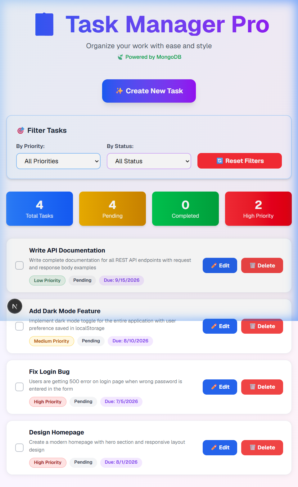
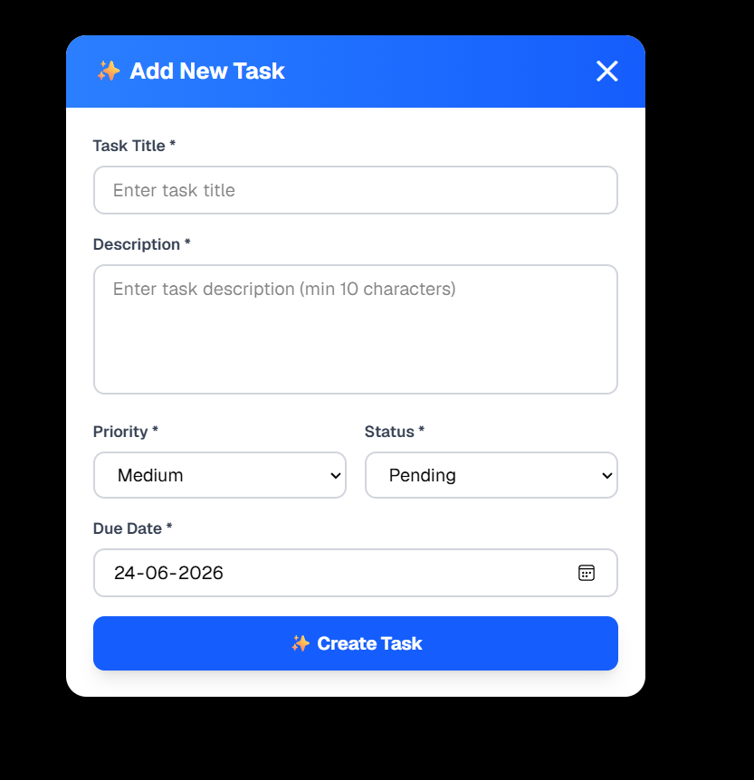

# 📋 Task Manager Pro

### A Modern Full-Stack Task Management Application

Manage your tasks with full CRUD operations, priority filters, status tracking, and a responsive user interface.

---

## 📸 Screenshots

### 💻 Desktop Dashboard


### 📝 Create / Edit Task Form


---

## ✨ Features

* **Create & Edit Tasks** — Add or update tasks using a sleek modal form.
  
  

* **Delete Tasks** — Delete tasks easily with custom actions.
* **Mark Tasks as Completed** — Animated completion checkmark with title strikethrough.
* **Priority Levels** — Low, Medium, and High task classifications.
* **Filter by Priority & Status** — Instantly filter tasks on the dashboard.
* **Dashboard Statistics** — Tracks Total, Pending, Completed, and High-Priority tasks.
* **MongoDB Database Integration** — Mongoose schemas for data persistence.
* **Responsive Design** — Fully optimized for mobile, tablet, and desktop views.
* **Smooth User Experience** — Micro-animations powered by Framer Motion.

---

## 🛠️ Tech Stack

| Layer           | Technology            |
| --------------- | --------------------- |
| Frontend        | Next.js 16 + React 19 |
| Language        | TypeScript            |
| Styling         | Tailwind CSS          |
| Backend         | Next.js API Routes    |
| Database        | MongoDB + Mongoose    |
| Package Manager | pnpm                  |

---

## 📁 Project Structure

```text
task_manager_pro/
├── app/
│   ├── api/tasks/
│   │   ├── route.ts
│   │   └── [id]/route.ts
│   ├── page.tsx
│   └── globals.css
├── components/
│   ├── TaskItem.tsx
│   ├── TaskFormSimple.tsx
│   ├── FilterPanel.tsx
│   ├── Modal.tsx
│   └── ValidationAlert.tsx
├── lib/
│   ├── mongodb.ts
│   └── models/Task.ts
├── .env.example
├── AI_USAGE.md
└── README.md
```

---

## 🚀 Setup & Installation

### Prerequisites

* Node.js v18+
* pnpm
* MongoDB

### Installation

```bash
git clone https://github.com/paritagodhani/task_manager_pro.git

cd task_manager_pro

pnpm install

cp .env.example .env.local
```

Update `.env.local`:

```env
MONGODB_URI=mongodb://localhost:27017/task-manager
```

Start MongoDB:

```bash
mongod
```

Run the application:

```bash
pnpm dev
```

Open:

```text
http://localhost:3000
```

---

## 📡 API Endpoints

| Method | Endpoint       | Description   |
| ------ | -------------- | ------------- |
| GET    | /api/tasks     | Get all tasks |
| POST   | /api/tasks     | Create a task |
| PUT    | /api/tasks/:id | Update a task |
| DELETE | /api/tasks/:id | Delete a task |

---

## 🗂️ Database Schema

| Field       | Type   |
| ----------- | ------ |
| title       | String |
| description | String |
| priority    | String |
| status      | String |
| dueDate     | Date   |
| createdAt   | Date   |
| updatedAt   | Date   |

### Priority Values

* Low
* Medium
* High

### Status Values

* Pending
* Completed

---

## 📱 Application Features

* Task Creation
* Task Editing
* Task Deletion
* Status Management
* Priority Management
* Task Filtering
* Dashboard Statistics
* Responsive Layout
* MongoDB Data Persistence

---

## 🌐 Deployment (Vercel / Render)

### Deploy to Vercel
1. Push this repository to your GitHub account.
2. Import the project on [Vercel](https://vercel.com).
3. Set the Environment Variable in Vercel settings:
   - `MONGODB_URI`: Your MongoDB Atlas (Cloud) connection string.
4. Click **Deploy**.

### Deploy to Render
1. Create a Web Service on [Render](https://render.com).
2. Connect your GitHub repository.
3. Set the Build Command to `pnpm build` and Start Command to `pnpm start`.
4. Set the Environment Variable:
   - `MONGODB_URI`: Your MongoDB Atlas (Cloud) connection string.
5. Click **Create Web Service**.

---

## 🤖 AI Usage Documentation

This project was developed with the assistance of AI. For detailed information about how AI was used, prompts, and modifications, refer to [AI_USAGE.md](./AI_USAGE.md).

---

### Developed using Next.js, TypeScript, Tailwind CSS, and MongoDB.
